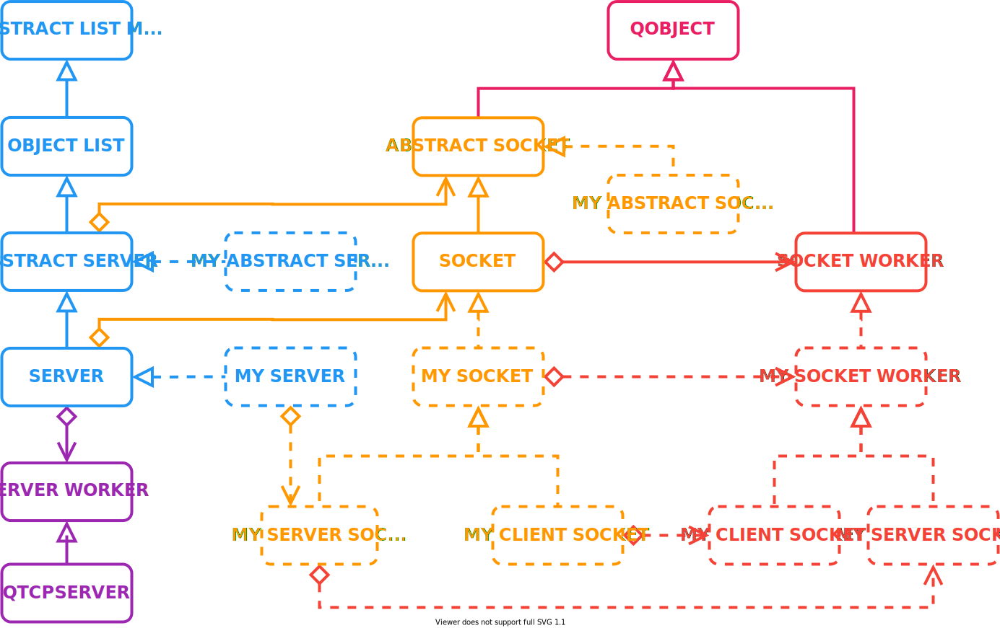

# NetTcp

NetTcp provide a Tcp `Server` that create Tcp `Socket` for each incoming connections for server side.

A `Socket` can also be used on client side to connect to a remote server.

## Overview



### Introduction

This library have 3 main classes:

* `Server`: Listen for incoming connection from a client. Create a new socket for each client.
* `Socket`: Allow to send data and receive data from a client. Or to connect to server and send/receive data.
* `SocketWorker`: Object that actually handle data stream and is supposed to reconstruct from it. This object can live in a worker thread or not by setting `useWorkerThread` in `Socket`.

The library won't do much out of the box. Inheritance from those class is required. The goal of this library is to provide easy to use object with all the required functionality to only focus on data transmission.

Most of the time when using TCP, a custom packet protocol needs to be implemented. In the following example, the protocol used will be very simple. The protocol goal is to send strings.

First byte will be header, and will indicate the length of the string. Maximum string length is 128. The string will follow. Data stream will look like that:


The header + payload stream structure is the most efficient way to transmit data because depending on the protocol (if packet size is known, or packet size have a limit), one or two read is only necessary to retrieve a full packet.

### Create a client

Creating a client is the easiest way to start, because only `Socket` and `SocketWorker` needs to be customize.

#### Socket Worker

Let's start by implementing a custom `SocketWorker`.

* Inherit from `Net::Tcp::SocketWorker`.
  * It's a QObject, so don't forget the Q_OBJECT macro.
* Override `void onDataAvailable()`. This function will be called each time new data is available to poll.
  * This function run in the worker thread. It' can either be a thread created by owning `Server`, or `Server` thread.
  * Call `size_t bytesAvailable()` to know how many bytes are in system buffer.
  * Call `size_t read(uint8_t* buffer, size_t max)` to read at maximum `max` bytes. The function return the real number of byte read.
  * If any problem happened call `closeAndRestart()`. Socket will try to restart later.
    * If the owning `Socket` have been created as a client, then it will reconnect to remote server later.
    * If the owning `Socket` have been created by a `Server`, the `Socket` will be completely destroy. It's the client responsibility to reconnect.
* Call `size_t write(const uint8_t* buffer, const size_t length)` to write data to the stream. The function returned the number of byte written. If byte written is 0 then retry later. Every buffer are full.
* **Don't forget to reset the *State Machine* when server disconnect or reconnect.**

The example is self explanatory.

* The function that write the data first write the header then write the payload (the string)
* The function that read wait for a header to read. Then poll every possible byte until the full string got read.
* Custom signals & slots are present to communicate with `Socket`.

```cpp
class MySocketWorker : public Net::Tcp::SocketWorker
{
    Q_OBJECT
public:
    MySocketWorker(QObject* parent = nullptr) : Net::Tcp::SocketWorker(parent) {}

private:
    bool waitingForData = false;
    uint8_t buffer[128] = {};
    uint8_t bufferLength = 0;
    uint8_t expectedSize = 0;

    void readHeader()
    {
        // Only read if something is available
        if (!bytesAvailable())
            return;

        // Only read if in correct state
        if (waitingForData)
            return;

        // Read 1 byte
        if (!read(&expectedSize, 1))
            return closeAndRestart();

        // Check header is valid
        if (expectedSize == 0 || expectedSize >= 128)
            return closeAndRestart();

        // Go to next state waiting for data
        waitingForData = true;
    }

protected Q_SLOTS:
    // !! DONT FORGET TO RELEASE BUFFER !! IMPORTANT !! //
    void onConnected() override final
    {
        Net::Tcp::SocketWorker::onConnected();
        waitingForData = false;
        bufferLength = 0;        
    }
    void onDataAvailable() override final
    {
        // Read header if not done
        if (!waitingForData)
            readHeader();

        // Otherwise read maximum number of bytes expected
        while(waitingForData && bytesAvailable())
        {
            // Read maximum data until the whole packet have been read.
            const auto bytesRead = read(buffer + bufferLength, expectedSize - bufferLength);
            bufferLength += uint8_t(bytesRead);

            // Emit the received string when read is complete
            if(bufferLength == expectedSize)
            {
                QString s(reinterpret_cast<char*>(buffer));
                Q_EMIT stringAvailable(s);
                waitingForData = false;
                bufferLength = 0;
                readHeader();
            }
        }
    }

public Q_SLOTS:
    void onSendString(const QString& s)
    {
        const auto data = s.toStdString();
        // Max packet size is 128
        if (data.length() >= 128)
            return;

        uint8_t size = uint8_t(data.length() + 1);
        // Write header
        if (!write(&size, 1))
            return closeAndRestart();
        // Write data
        if (!write(data.c_str(), size))
            return closeAndRestart();
    }
Q_SIGNALS:
    void stringAvailable(const QString& s);
};
```

#### Create Socket

Now let's implement a custom `Socket`. It will be responsible of:

* Sending string to the worker
* Receiving string from the worker
* Create the wanted custom worker by overriding `std::unique_ptr<Net::Tcp::SocketWorker> createWorker()`.

```cpp
class MySocket : public Net::Tcp::Socket
{
    Q_OBJECT
public:
    MySocket(QObject* parent = nullptr) : Net::Tcp::Socket(parent) {}

protected:
    std::unique_ptr<Net::Tcp::SocketWorker> createWorker() override
    {
        auto worker = std::make_unique<MySocketWorker>();

        // Send string to worker
        connect(this, &MySocket::sendString, worker.get(), &MySocketWorker::onSendString);

        // Receive string from worker
        connect(worker.get(), &MySocketWorker::stringAvailable, this, &MySocket::stringReceived);

        return std::move(worker);
    }

Q_SIGNALS:
    void sendString(const QString& s);
    void stringReceived(const QString& s);
};
```

#### Start the client

```cpp
int main(int argc, char* argv[])
{
    QCoreApplication app(argc, argv);
    MySocket client;
    client.start("127.0.0.1", 9999);
    client.sendString("My String");
    return QCoreApplication::exec();
}
```

If anything fail in the connection or during an exchange, a watchdog will try to reconnect to server.

* You can customize the watchdog with `bool setWatchdogPeriod(const quint64& ms)`.
* Or call `restart` to force a restart before watchdog end.

### Create a Server

Let's create a custom server than can receive strings for multiple clients. Because packet formatting is the same than on client side, let's reuse `MySocketWorker`. Let's also reuse `MySocket` that can already send and receive strings.

#### Create a custom Server

Let's create a `MyServer` that create `MySocket` for each client that connect. When a string is received by the server, the message is echoed to the client.

* Override `Net::Tcp::AbstractSocket* newTcpSocket(QObject* parent)` to create a new socket each time a client connects.

```cpp
class MyServer : public Net::Tcp::Server
{
    Q_OBJECT
protected:
    Net::Tcp::AbstractSocket* newTcpSocket(QObject* parent) override
    {
        const auto s = new MySocket(parent);
        connect(s, &MySocket::stringReceived, [this, s](const QString& string)
            {
                qInfo("RX \"%s\" from client %s:%d", qPrintable(string), qPrintable(s->peerAddress()), signed(s->peerPort()));
                Q_EMIT s->sendString(string);
            });
        return s;
    }
};
```

Then simply start the server by giving the port that it needs to listen to.

```cpp
int main(int argc, char* argv[])
{
    QCoreApplication app(argc, argv);
    MyServer server;
    server.start(9999);
    return QCoreApplication::exec();
}
```

By default the server will listen on any interface. It's also possible to listen only a specified interface by calling `bool start(const QString& address, const quint16 port)`.

A watchdog will take care a rebinding to the interface/port if something failed.

* You can customize the watchdog with `bool setWatchdogPeriod(const quint64& ms)`.

#### React to Server

It's possible to react to multiple signals from the `Server`.

* `isListeningChanged` tell if the Server is correctly listening to `port` and `address`.
* `void acceptError(int error, const QString description)` indicate an error occured with  a client connection.
* `void newClient(const QString& address, const quint16 port)` tell when a new client is connected
* `void clientLost(const QString& address, const quint16 port);` tell when a client got disconnected

### Dependencies

* The library depends on C++ 14 STL.
* [ObjectListModel](https://github.com/OlivierLDff/ObjectListModel.git) that make look `Server` like a list of `Socket`.
* Qt Core and Network for the backend.
* Qml dependencies:
  * Qt Qml Quick Control2
  * [Stringify](https://github.com/OlivierLDff/Stringify)
  * [Qaterial](https://github.com/OlivierLDff/Qaterial)

### Tools

* [CMake](https://cmake.org/) v3.14 or greater.
* C++14 compliant compiler or greater.
* Internet connection to download dependencies from *Github* during configuration.

## Example

An example that implement a client/server connection that exchange string is available in `examples` folder.

```bash
> NetTcp_EchoClientServer -h

Options:
  -?, -h, --help    Displays this help.
  -t                Make the worker live in a different thread. Default false
  -s, --src <port>  Port for rx packet. Default "9999".
  -i, --ip <ip>     Ip address of multicast group. Default "127.0.0.1"
```

You can also check `NetTcp_EchoServer` that implement only the server code that reply echo to client that will connect. 

And check `NetTcp_EchoClient`, example of a client that will connect to a server and send a string.

## Qml Debug

This library also provide a tool object that demonstrate every Qmls functionality. This is intended for quick debug, or test functionalities if UI isn't built yet.


In order to use this qml object into another qml file, multiple steps are required.

* Call `Net::Tcp::Utils::registerTypes(...)` to register `AbstractServer`, `Server`, `AbstractSocket`, ... to the qml system
* Call `Net::Tcp::Utils::loadResources()` to load every `NetTcp` resources into the `qrc`.

Then simply to something like that:

```js
import NetTcp.Debug 1.0 as NetTcpDebug
import NetTcp 1.0 as NetTcp

Rectangle
{
    property NetTcp.Server server
    property NetTcp.Socket client
    
    width: 300
    height: 300
    
    Column
    {
        width: parent.width
        NetTcpDebug.Server
        {
            object: server
        	width: parent.width
        }
        NetTcpDebug.Socket
        {
            object: client
        	width: parent.width
        }
    }
}
```

* `NetTcp.Debug.Server` is a `Qaterial.DebugObject`. If you want the raw content to display it somewhere else, then use `NetTcp.Debug.ServerContent` that is a `Column`.
* `NetTcp.Debug.Socket` is a `Qaterial.DebugObject`. If you want the raw content to display it somewhere else, then use `NetTcp.Debug.SocketContent` that is a `Column`.

## Configuring

This library use CMake for configuration.

```bash
git clone https://github.com/Naostage/NetTcp
cd NetTcp
mkdir build && cd build
cmake ..
```

The `CMakeLists.txt` will download every dependencies for you.

## Building

Simply use integrated cmake command:

```bash
cmake --build . --config "Release"
```

### Execute Examples

```bash
cmake -DNETTCP_ENABLE_EXAMPLES=ON ..
cmake --build . --target NetTcp_EchoClientServer
./NetTcp_EchoClientServer
```

## Integrating

Adding NetTcp library in your library is really simple if you use CMake 3.14.

In your `CMakeLists.txt`:

```cmake
# ...
include(FetchContent)
FetchContent_Declare(
    NetTcp
    GIT_REPOSITORY "https://github.com/OlivierLDff/NetTcp"
    GIT_TAG        "master"
)
# ...
FetchContent_MakeAvailable(NetTcp)
# ...

target_link_libraries(MyTarget NetTcp)
```

Then you just need to `#include <NetTcp.hpp>`.

## Authors

* [Olivier Le Doeuff](https://github.com/OlivierLDff)