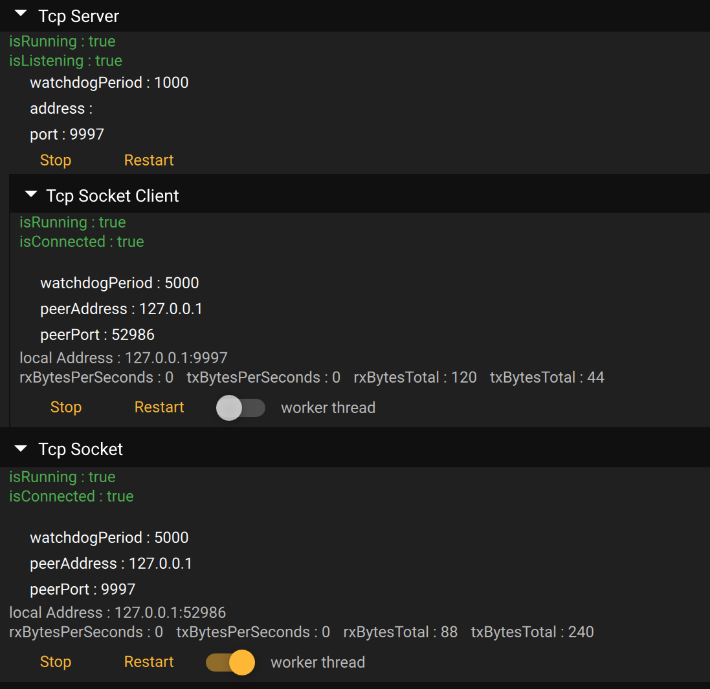

# Qml Debug

This library also provide a tool object that demonstrate every Qmls functionality. This is intended for quick debug, or test functionalities if UI isn't built yet.



In order to use this qml object into another qml file, multiple steps are required.

* Call `Net::Tcp::Utils::registerTypes(...)` to register `AbstractServer`, `Server`, `AbstractSocket`, ... to the qml system
* Call `Net::Tcp::Utils::loadResources()` to load every `NetTcp` resources into the `qrc`.

Then simply to something like that:

```js
import NetTcp.Debug 1.0 as NetTcpDebug
import NetTcp 1.0 as NetTcp

Rectangle
{
    property NetTcp.Server server
    property NetTcp.Socket client

    width: 300
    height: 300

    Column
    {
        width: parent.width
        NetTcpDebug.Server
        {
            object: server
            width: parent.width
        }
        NetTcpDebug.Socket
        {
            object: client
            width: parent.width
        }
    }
}
```

* `NetTcp.Debug.Server` is a `Qaterial.DebugObject`. If you want the raw content to display it somewhere else, then use `NetTcp.Debug.ServerContent` that is a `Column`.
* `NetTcp.Debug.Socket` is a `Qaterial.DebugObject`. If you want the raw content to display it somewhere else, then use `NetTcp.Debug.SocketContent` that is a `Column`.

## Example

A basic example `NetTcp_EchoClientServerQml` also demonstrate the same example as the C++ examples, but with qml debug widget.