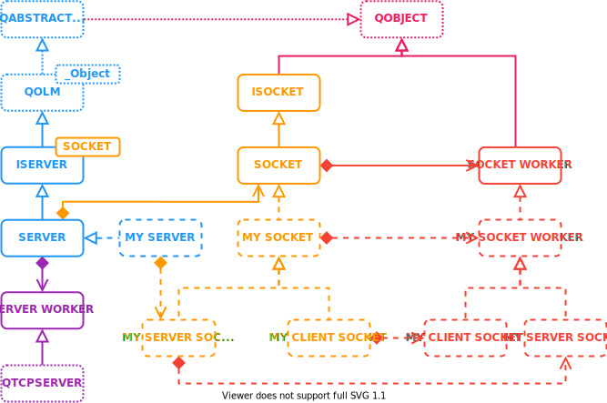

# NetTcp

NetTcp provide a Tcp `Server` that create Tcp `Socket` for each incoming connections for server side.

A `Socket` can also be used on client side to connect to a `Server`.

## Overview

* Learn how to create a [Client](https://olivierldff.github.io/NetTcp/GettingStart.html#create-a-client) and a [Server](https://olivierldff.github.io/NetTcp/GettingStart.html#create-a-server).
* Checkout [Examples](https://olivierldff.github.io/NetTcp/GettingStart.html#examples).
* [Use the library with QML](https://olivierldff.github.io/NetTcp/QmlUsage.html).
* [Build the library](https://olivierldff.github.io/NetTcp/BuildAndRun.html).